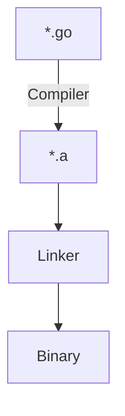
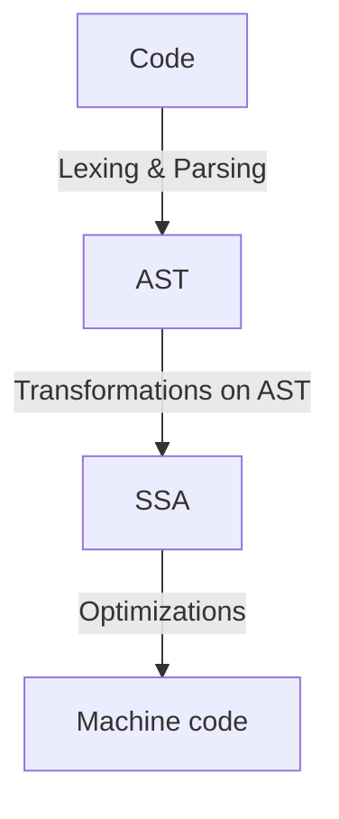

# Go compilation tools

**Source**: https://www.youtube.com/watch?v=qPIB3STWXVk
### Flow



If go files are unmodified, there's no need to compile them again. This makes rebuild faster. 
### Compilation



SSA is platform agnostic
### go build flags

- `-a` = force rebuild after clearing cache
- `-v` = shows list of packages used in the build
- `-x` = shows internal tooling invocation 
- `-n` = same as `-x` but dry run options, just shows the plan what will be done
- `-work` = print and keep the work dir (where all intermediate artifacts are stored)

### Explore compilation internal steps

```
GOSSAFUNC=main go build -a # generates ssa html for going into depth 
```

This is fun interactive way to check the intermediate compilation steps. 
### Compiler flags

- `-gcflags="-S"` = shows intermediate assembly
	- This is different from platform specifc assembly, if you want to see platform specific code:
	```
	go tool objdump -S main.main <bin_name>
	```

- `-gcflags="-N"` = disable compiler optimization
- `-gcflags="-m"` = shows escape analysis (explains what goes in heap vs stack) `-m=2` for verbose, useful to see how much garbage is generated
- `-gcflags="-live"` = shows liveness analysis. calculate live variables at each point in program. 
- `-gcflags="-bench=bench.out"` = shows benchmark 
- `-gcflags="-race"` = race detection
- `-gcflags="-memprofile=profile.out"` = shows memory profile in lifetime of build
	- Use `go tool pprof -http :7070 profile.out` to open in webui
- `-gcflags="-traceprofile=trace.out"`= shows execution trace


## go list

Shows meta information about gocode. See [docs](https://pkg.go.dev/cmd/go/internal/list) for all fields available in templating. 

#### List all go files that go in the build
```
go list -f {{.GoFiles}} 

GOOS=windows go list -f {{.GoFiles}} # includes main_windows.go (windows specific files)
```

## nm tool

Shows all symbols used by the binary. Useful for figuring out dynamic libararies used etc. 
```
go tool nm <binname>
```

## Questions
- While this does go in depth on practical tools, need more indepth understanding of compilation process #question 
	- https://www.youtube.com/watch?v=uTMvKVma5ms&t=10s
- Need to explore go runtime as well #question 
- How does this integrate with gdb and other debuggers ? #question 
## Related
- [go-build](/go/go-build.md)